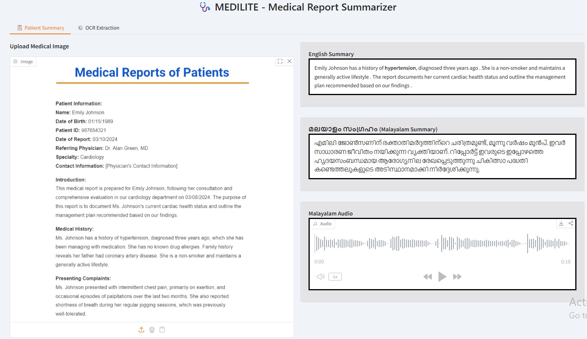

# 🩺 MEDILITE – Medical Report Summarizer

MEDILITE is an AI-powered medical report summarization system that extracts text from medical report images, generates concise English summaries, translates them into Malayalam, highlights important medical terms, and provides Malayalam voice output.

## Features

- OCR-based text extraction from medical report images
- English summary generation using T5 Transformer
- English to Malayalam translation
- Medical keyword highlighting
- Malayalam voice generation
- User-friendly Gradio interface

## Technologies Used

- Python
- T5 Transformer
- MarianMT
- PyTesseract OCR
- Pillow
- gTTS
- Gradio

## Workflow

Medical Report Image → OCR → Text Cleaning → English Summary → Malayalam Translation → Voice Output

## Run the Project

```bash
python app.py
```

## Project Information

- Final Year B.Tech CSE Project
- Research Paper Presented at ICSTS 2025

Check out the configuration reference at https://huggingface.co/docs/hub/spaces-config-reference
## Project screenshot

